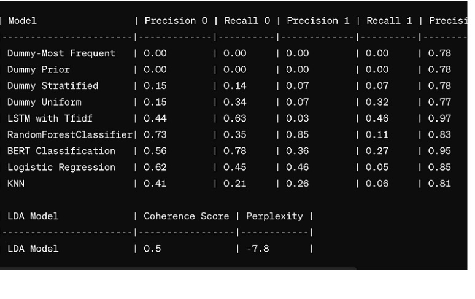

# Amazon Customer Reviews Sentiment Analysis
==============================

## Table of Contents
1. [Project Overview](#project-overview)
2. [Installation and Setup](#installation-and-setup)
    - [Run Locally](#run-locally)
    - [Python Packages Used](#python-packages-used)
4. [Data](#data)
    - [Source Data](#source-data)
    - [Data Acquisition](#data-acquisition)
    - [Data Preprocessing](#data-preprocessing)
5. [Project Organization](#project-organization)
6. [Results and Evaluation](#results-and-evaluation)
7. [Future work](#future-work)
8. [Acknowledgments](#acknowledgments)
9. [License](#license)

# Project Overview

This project aims to analyze sentiment in Amazon customer reviews.
By utilizing natural language processing (NLP) techniques, we seek to extract insights from customer feedback to understand overall sentiment trends and identify areas for improvement for business owners/sellers on Amazon.

In this project you'll find in the Jupyter Notebooks, how we used:
web scraping, large language models, BERT regression and BERT classification neural network transformers, LSTM models, Lime analysis, BERTopic, WordClouds, TF-IDF Vectorization, LDA, spaCy, and Zero-shot learning.

# Installation and Setup

## Run Locally
run the scraper, and the getting insights notebook locally, 
and clone the repository: 
git clone https://github.com/your-username/entiment_analysis_on_amazon_reviews.git


## Python Packages Used
- **General Purpose:** grequests, os, beautifulsoup, regex
- **Data Manipulation:** pandas, numpy
- **Data Visualization:** matplotlib, seaborn
- **Machine Learning:** scikit-learn, nltk, spacy, transformers


# Data

## Source Data
The dataset was obtained from [Kaggle](https://www.kaggle.com/code/saurav9786/recommendation-based-on-amazon-food-review/input). It was downloaded as a zipped CSV file and stored in the 'data/raw' directory.

## Data Acquisition
Web scraping from an Amazon's product url. The scraper utilizes grequests, BeautifulSoup, and pandas libraries, and it extracts English reviews only.
The scraper begins its operation when a user inputs the product's Amazon review URL.
Then, it fetches the reviews (up to 500 total reviews) and conducts light preprocessing, such as removing newline characters (‘\n’). Further preprocessing steps applied later in the code. 
The reviews are saved into a CSV file encoded in UTF-8 format, ensuring compatibility and readability across different systems and applications.

## Data Preprocessing
Data preprocessing steps involved cleaning the text data by removing special characters, lowercasing text, and removing stop words. Additionally, text was tokenized and lemmatized to prepare it for analysis..

# Project Organization
------------

```bash
├── data
│   ├──raw
│        ├──Reviews.csv.zip
├── notebooks    
│      ├──web scraper
│        ├── tal_web_scraper_on_amazon_customers_reviews.ipynb
│      ├── dan-tal-baseline_model_edited_original_unite_classes.ipynb
│      ├── nick-lime-analysis.ipynb
│      ├── dan_lstm_lime.ipynb
│      ├── nick_bert_topic.ipynb
│      ├── dan_bert_cluster.ipynb
│      ├── nick_lime_spacy.ipynb
│      ├── nick_phrase_functions.ipynb
│      ├── nick_topic_testing_adjectives.ipynb
│      ├── nick_topic_testing_nouns.ipynb
│      ├── nick_zero_shot_classification.ipynb
│      ├── nick_topic_testing_adjectives.ipynb
│      ├── tal_llm_generate_summary.ipynb
├── src    
│      ├──features
│        ├── topic_functions_adjectives.py
│        ├── topic_functions_nouns.py
│        ├── topics.py
├── LICENSE
├── README.md
└── .gitignore
├── requirements.txt
```

# Results and Evaluation



# Future work
Potential future work:
- Building a real-time sentiment monitoring system for Amazon reviews.
- Exploring LLM and more deep learning models for sentiment analysis to improve accuracy.

# Acknowledgments
​ITC - Israel Tech Challenge

Nick Mishkin [Linkin link](https://www.linkedin.com/in/nickmishkin/), Dan Finel [Linkin link](https://www.linkedin.com/in/dan-finel/) and Tal Ramon [Linkin link](https://www.linkedin.com/in/talramon/).


# License
Kaggle's data set [Kaggle](https://www.kaggle.com/code/saurav9786/recommendation-based-on-amazon-food-review/comments)
For this github repository, the License used is [MIT License](https://opensource.org/license/mit/).


--------

<p><small>Project based on the <a target="_blank" href="https://drivendata.github.io/cookiecutter-data-science/">cookiecutter data science project template</a>. #cookiecutterdatascience</small></p>
